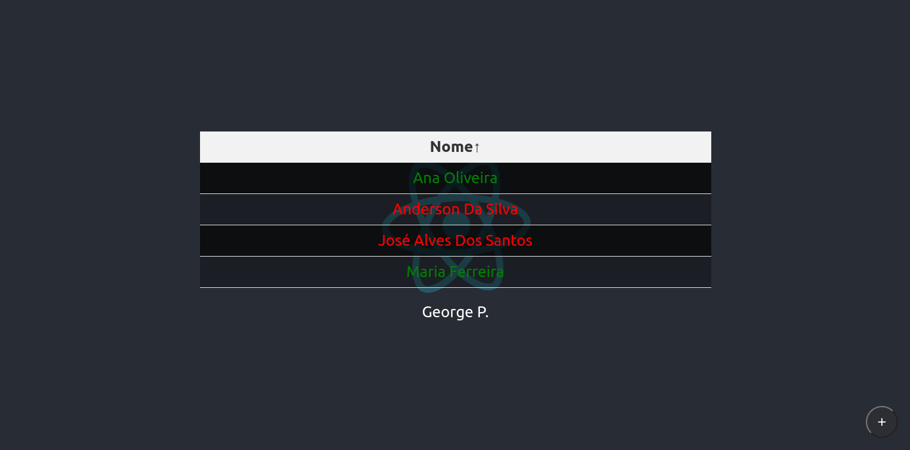

# Sample ReactJS JSON

Site to show meaningful qualities about front-end development in ReactJs using JavaScript as programming language.

## Run Locally

Clone the project:

```bash
  git clone https://github.com/GeorgePaulino/sample-react-json-js
  cd sample-react-json-js
```

Install dependencies and run the server:

```bash
  npm install
  npm start
```

After access <http://localhost:3000/>

## Screenshots


